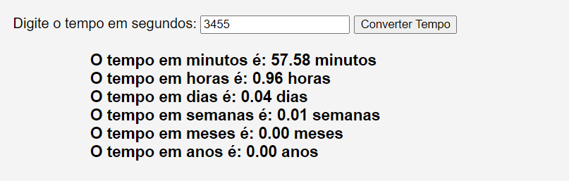

# CALCULADORA DE TEMPO
🆎CONVERTE SEGUNDOS EM MINUTOS, HORAS, DIAS, SEMANAS, MESES E ANOS. 

 <br>

## DESCRIÇÃO:
Esse é um aplicativo web simples chamado "Conversor de Tempo". Ele consiste em uma página HTML com um formulário onde o usuário pode inserir um valor de tempo em segundos. Quando o botão "Converter Tempo" é clicado, a função JavaScript `converterTempo()` é acionada. Esta função realiza cálculos para converter o tempo inserido em segundos para minutos, horas, dias, semanas, meses e anos, usando algumas aproximações.

Aqui está uma descrição do que o código faz:

1. **HTML:**
   - A página HTML contém um formulário simples com um campo de entrada para o tempo em segundos e um botão para acionar a conversão.
   - O resultado da conversão será exibido no elemento de rodapé (`<footer>`).

2. **JavaScript (`CODIGO.js`):**
   - A função `converterTempo()` é chamada quando o botão é clicado.
   - Dentro da função, o tempo em segundos é capturado do formulário.
   - São realizados cálculos para converter esse tempo em minutos, horas, dias, semanas, meses e anos.
   - Os resultados são exibidos no elemento de rodapé (`<footer>`) da página.

3. **Aproximações utilizadas:**
   - O código usa aproximações para converter tempo em meses e anos, assumindo que um mês tem 30 dias e um ano tem 365 dias.

## COMO USAR?
* Clone o repositório para o seu sistema local:

```bash
git clone https://github.com/VILHALVA/CALCULADORA-DE-TEMPO.git
```

* Navegue até o diretório do projeto.

```bash
cd CALCULADORA-DE-TEMPO
```

* Descompacte o arquivo ZIP (se você baixou manualmente):

```bash
unzip CALCULADORA-DE-TEMPO.zip
```
* Abra o arquivo `CODIGO.html` em seu navegador de preferência.

## NÃO SABE?
- Entendemos que para manipular arquivos em `HTML`, `CSS` e outras linguagens relacionadas, é necessário possuir conhecimento nessas áreas. Para auxiliar nesse aprendizado, oferecemos cursos gratuitos disponíveis:
* [Curso de HTML e CSS](https://github.com/VILHALVA/CURSO-DE-HTML-E-CSS)
* [Curso de JavaScript](https://github.com/VILHALVA/CURSO-DE-JAVASCRIPT)
* [Confira mais cursos](https://github.com/VILHALVA?tab=repositories&q=+topic:CURSO)

## CREDITOS:
- [PROJETO CRIADO PELO VILHALVA](https://github.com/VILHALVA)
- [ESTÁ DISPONIVEL NO SITE](https://vilhalva.github.io/STYLER/STYLER.html)
